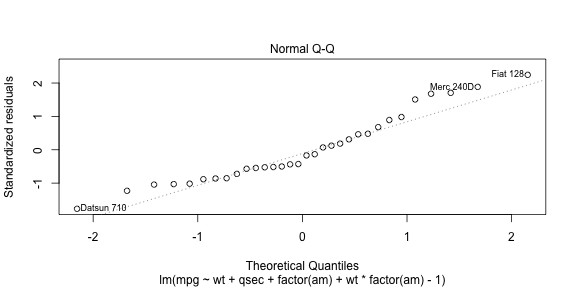

##Executive Summary:
The goal of this project is to answer some questions using regression models and exploratory data analyses.  We are particularly interested in answering the following questions:

* Is an automatic or manual transmission better for MPG?

* Quantify the MPG difference between automatic and manual transmissions.

We are going to use the `mtcars` data set to answer the questions.

##Exploratory Data Analyses:
Consider the `mtcars` data set.  We'll start by looking at dimensions and variable names.

```
## [1] 32 11
```

```
##  [1] "mpg"  "cyl"  "disp" "hp"   "drat" "wt"   "qsec" "vs"   "am"   "gear"
## [11] "carb"
```
Look at the first 6 rows of data set.

```
##                    mpg cyl disp  hp drat    wt  qsec vs am gear carb
## Mazda RX4         21.0   6  160 110 3.90 2.620 16.46  0  1    4    4
## Mazda RX4 Wag     21.0   6  160 110 3.90 2.875 17.02  0  1    4    4
## Datsun 710        22.8   4  108  93 3.85 2.320 18.61  1  1    4    1
## Hornet 4 Drive    21.4   6  258 110 3.08 3.215 19.44  1  0    3    1
## Hornet Sportabout 18.7   8  360 175 3.15 3.440 17.02  0  0    3    2
## Valiant           18.1   6  225 105 2.76 3.460 20.22  1  0    3    1
```
There exists 32 rows of car models with 11 variables.  In our analysis, we'll fit a linear model with MPG as the outcome and other 10 variables as the predictive variables. We'll start by fitting a model with all variables.

```
##         Estimate Std. Error     t value   Pr(>|t|)
## cyl   0.35082641 0.76292423  0.45984438 0.65014009
## disp  0.01354278 0.01762273  0.76848373 0.45037109
## hp   -0.02054767 0.02143989 -0.95838513 0.34828334
## drat  1.24158213 1.46276742  0.84878985 0.40513967
## wt   -3.82613150 1.86238084 -2.05443023 0.05200271
## qsec  1.19139689 0.45942323  2.59324480 0.01659185
## vs    0.18972068 2.06824861  0.09173011 0.92774262
## am    2.83222230 1.97512820  1.43394353 0.16564985
## gear  1.05426253 1.34668717  0.78285629 0.44205756
## carb -0.26321386 0.81235653 -0.32401273 0.74898869
```
Fitting a model with 10 predictive variables results in no significant P-values (less than 0.05).  We eliminate some regressors to determine a model with better fit.  After eliminating regressors from the order of high P-values, I end up with a model with wt, qsec and am as significant regressors.  Here's the coefficient estimates and R-squared.

```
##              Estimate Std. Error   t value     Pr(>|t|)
## wt          -3.916504  0.7112016 -5.506882 6.952711e-06
## qsec         1.225886  0.2886696  4.246676 2.161737e-04
## factor(am)0  9.617781  6.9595930  1.381946 1.779152e-01
## factor(am)1 12.553618  6.0573391  2.072464 4.754335e-02
```

```
## [1] 0.9879446
```
To determine if I should include any interaction term, I check for correlation between Transmission (am) and each regressors.

```
##            wt       qsec
## am -0.6924953 -0.2298609
```
Weight (wt) has -0.69 correlation to Transmission (am).  This means that there is a negative correlation, so I include the interaction term am*wt.  Here's the coefficient estimates and R-squared.

```
##                 Estimate Std. Error   t value     Pr(>|t|)
## wt             -2.936531  0.6660253 -4.409038 0.0001488947
## qsec            1.016974  0.2520152  4.035366 0.0004030165
## factor(am)0     9.723053  5.8990407  1.648243 0.1108925394
## factor(am)1    23.802480  6.0768244  3.916927 0.0005511252
## wt:factor(am)1 -4.141376  1.1968119 -3.460340 0.0018085763
```

```
## [1] 0.9916484
```
Using this model to answer the first question, "Is an automatic or manual transmission better for MPG?", compare the coefficients of factor(am)0 and factor(am)1.  Factor(am)0 is a factor for automatic transmission with coefficent = 9.723.  This means that for automatic transmission, your MPG gain is 9.723mpg.  Factor(am)1 is a factor for manual transmission with coeficcient = 23.801.  This means that for manual transmission, your MPG gain is 23.801mpg.  Clearly, manual transmission is better for MPG by a difference of 14.078mpg.

##Residuals Diagnostics:
Residuals should be uncorrelated with the fit and independent and nearly identically distributed with mean zero.  We'll look at the plot of residuals against fitted values.  We see a few outliers that may be influential.    (Appendix: Figure 1)


We'll look at the Q-Q plot next.  We see that residuals are along the line of normality.  Notice we have the same outliers as the previous plot.  (Appendix: Figure 2)


Next, we find influence of the outliers on coefficients.  Outliers are Datsun 710, Fiat 128 and Mercedes 240D.  Influence on coefficients are higher for the outliers, but not dramatically high.  My decision is to leave the outliers in the model because looking also at the plots, they do not seem to influence the normality and correlation within the fit.

```
##                wt   qsec factor(am)0 factor(am)1 wt:factor(am)1
## Datsun 710 -0.079 -0.251       0.229       0.147          0.007
## Fiat 128    0.169  0.536      -0.489      -0.323         -0.082
## Merc 240D  -0.243  0.339      -0.121      -0.311          0.276
```

```
##                  wt  qsec factor(am)0 factor(am)1 wt:factor(am)1
## Mazda RX4     0.010 0.031      -0.028      -0.022         -0.034
## Mazda RX4 Wag 0.003 0.009      -0.008      -0.016          0.025
```


##Appendix:
Figure 1
 

Figure2
 
